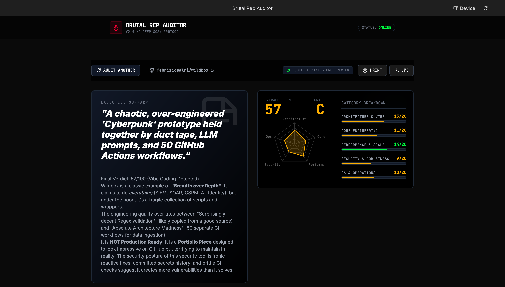

# 💀 Brutal Rep Auditor

> "Is your code Engineering Substance or AI Slop?"

**Brutal Rep Auditor** is a ruthless, AI-powered technical due diligence tool. It uses Google's Gemini 2.5 Flash model to ingest a GitHub repository's structure, commit history, and critical files to generate a "Brutal Reality Check" report.

## 🔥 Features

- **Phase 1: The Matrix**: A 20-point deep dive into Architecture, Engineering, Performance, Security, and QA.
- **Phase 2: Vibe Check**: AI-driven analysis of "Generic ChatGPT Code" vs "Production Engineering".
- **Phase 3: The Fix Plan**: A prioritized, no-nonsense remediation list.
- **GitHub Integration**: Auto-fetches file trees, readmes, and commit logs via GitHub API.
- **Print-Ready**: Dedicated styles for generating clean PDF reports ("Audit Another Repo" buttons are hidden in print mode).

## 🚀 Tech Stack

- **Frontend**: React 19, TailwindCSS, Lucide Icons
- **AI**: Google Gemini API (`gemini-2.5-flash`)
- **Charts**: Recharts
- **Markdown**: React-Markdown

## 🛠️ Setup

1. Clone the repo
2. Install dependencies: `npm install`
3. Set your API Key: `export API_KEY=your_gemini_key`
4. Run: `npm start`

## ⚖️ License

MIT // USE AT YOUR OWN RISK