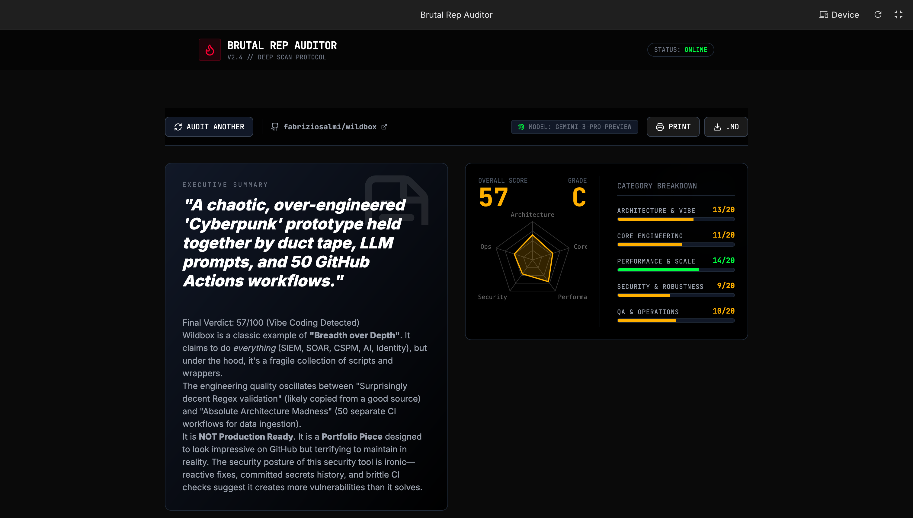

# 💀 Brutal Rep Auditor

> "Is your code Engineering Substance or AI Slop?"



**Brutal Rep Auditor** is a ruthless, AI-powered technical due-diligence tool. Paste a public GitHub repo URL and it fetches the repo's structure, commit history, and a sample of its files, then asks Google's Gemini to produce a "Brutal Reality Check": a scored, opinionated audit that tries to separate *Engineering Substance* from *AI Slop*.

It runs entirely in the browser — there is no backend.

## 🚀 Quickstart

```bash
git clone https://github.com/fabriziosalmi/brutal-coding-tool && cd brutal-coding-tool
npm install
npm run dev
```

Then open <http://localhost:3000>, paste a repo URL, enter your **Google Gemini API key** ([get a free one from Google AI Studio](https://aistudio.google.com/apikey)) in the field on the page, and hit **Initiate Brutal Audit**.

> **Bring-your-own-key (BYO-key).** There is no backend and no build-time key. You paste your Gemini key into the UI; it is saved in your browser's `localStorage` and sent only to Google's Gemini API — it is never committed and never inlined into the JavaScript. Because nothing secret is baked into the build, the site is **safe to deploy publicly**.

## 🎬 Demo

**Input** — a public repo URL (optionally a GitHub token under *Advanced Options* to dodge API rate limits):

```
https://github.com/fabriziosalmi/wildbox
```

**Output** — the app fetches context, runs the audit, and renders a report (see the screenshot above). In that run it returned:

- **Verdict**: *"A chaotic, over-engineered 'Cyberpunk' prototype held together by duct tape, LLM prompts, and 50 GitHub Actions workflows."*
- **Score**: `57/100` — Grade **C** (*Vibe Coding Detected*)
- **Radar + breakdown**: Architecture & Vibe `13/20`, Core Engineering `11/20`, Performance & Scale `14/20`, Security & Robustness `9/20`, QA & Operations `10/20`

Below the fold it also renders **Phase 1** (the 20-point matrix), **Phase 2** (the vibe-check write-up), and **Phase 3** (a prioritized fix plan). You can then **Print** to PDF or export **Markdown**. The exported `.md` is structured like this:

```markdown
# BRUTAL AUDIT REPORT: wildbox

## VERDICT
A chaotic, over-engineered 'Cyberpunk' prototype ...

## SCORE: 57/100

Wildbox is a classic example of "Breadth over Depth" ...

## PHASE 1: THE MATRIX
### Architecture & Vibe
- **[3/5] Dependency Hygiene**: Pinned, but bloated ...
...

## PHASE 2: VIBE CHECK
...

## PHASE 3: FIX PLAN
1. Consolidate the 50 CI workflows ...
```

> Scores are LLM-generated and **non-deterministic** (temperature `0.7`) — the same repo will not score identically across runs.

## 🔥 What it does

- **Phase 1 — The Matrix**: requests a 20-point deep dive across Architecture, Core Engineering, Performance, Security, and QA (5 categories × 4 metrics).
- **Phase 2 — Vibe Check**: a markdown write-up explaining the "Vibe Ratio" (Generic AI code vs. Production engineering).
- **Phase 3 — The Fix Plan**: a prioritized, no-nonsense remediation list.
- **GitHub integration**: auto-fetches the README, latest commits, file tree, key manifests, and a couple of source samples via the public GitHub API.
- **Export**: Markdown download + a print-optimized layout for clean PDFs.

## 🛠️ Tech Stack

- **Frontend**: React 19 + Vite, Tailwind (via CDN), Lucide icons
- **AI**: Google Gemini via `@google/genai` — tries `gemini-3-pro-preview`, falls back to `gemini-2.5-flash`
- **Charts**: Recharts · **Markdown**: react-markdown

## 🧪 Development

```bash
npm run dev        # start the dev server (port 3000)
npm run lint       # ESLint
npm run typecheck  # tsc --noEmit
npm run test       # Vitest unit tests
npm run build      # production build into dist/
```

CI (GitHub Actions) runs lint → typecheck → test → build on every push and PR to `main`.

## ⚖️ Honest status & limitations

This is a **local, single-purpose developer toy**, not a hardened product. Read this before relying on it:

- **The audit is an LLM opinion, not ground truth.** It's non-deterministic, can be wrong or hallucinate, and is no substitute for a real code/security review. The footer says *"USE AT YOUR OWN RISK"* — it means it.
- **Analysis is sampled, not exhaustive.** The tool sends Gemini only: the README, the **latest 20 commits**, the first **300** file paths, up to **3** manifest files (`package.json`, `Cargo.toml`, `go.mod`, `requirements.txt`, `pom.xml`, `docker-compose.yml`, `Dockerfile`, `Makefile`), and the **2 largest** source files between 1–50 KB (first 200 lines each). It does **not** read your whole repo.
- **Bring-your-own-key — no key is baked into the build.** Each visitor enters their own Gemini key in the UI; it is stored in that browser's `localStorage` and sent only to Google's API. The build inlines nothing secret, so the site is **safe to host publicly** — everyone brings their own key. (That key still travels from the browser directly to Google, so only paste a key you're comfortable using client-side.)
- **GitHub calls are unauthenticated by default** and hit rate limits quickly (especially on shared/cloud IPs → `403`). Add a GitHub token under *Advanced Options*; it's used only client-side for direct calls to `api.github.com` and is not stored.
- **Public repos only** — private repos aren't supported.
- **`gemini-3-pro-preview` may not be enabled on your key**, in which case it silently falls back to `gemini-2.5-flash`. UI labels like "V2.4 // DEEP SCAN PROTOCOL" are flavor, not versioned guarantees.
- **Test coverage is thin**: unit tests cover the GitHub service logic (URL parsing, rate-limit handling, context formatting). There are no end-to-end/browser tests yet.
- **Tailwind is loaded from a CDN** (`cdn.tailwindcss.com`), which Tailwind does not recommend for production.

## ⚖️ License

MIT // USE AT YOUR OWN RISK
